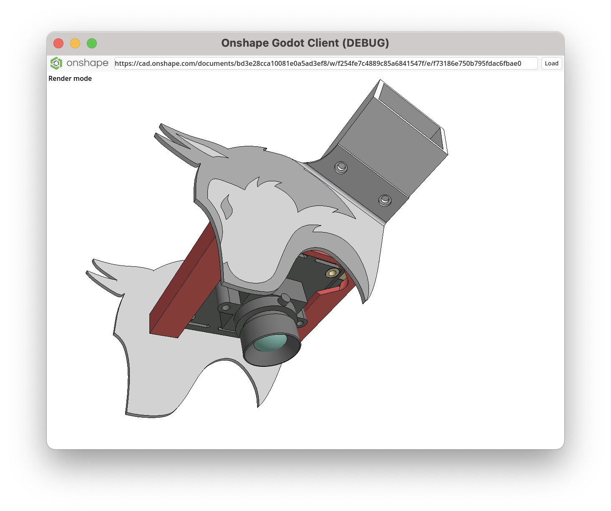

# Onshape Godot Client

## Background

This is a **very basic, unofficial, and unsupported** Onshape client created in
Godot 4.1.

**Do not use it for anything production related.**

It may be helpful as an example of interacting with Onshape's `tessellatededges`
and `tessellatedfaces` APIs, as well as shaders that produce a somewhat
"Onshapey" look. I'm hoping to add more functionality over time, but I provide
no guarantees about if/when any additional improvements will come, as this is an
unofficial and unsupported project.

## Setup

For the project to run, you'll need to make a file `creds.gd` in the root
directory with your Onshape API key in the following format:
```
extends Node

var access_key = "ONSHAPE_API_ACCESS_KEY"
var secret_key = "ONSHAPE_API_SECRET_KEY_IT_IS_THE_LONG_ONE"
```

## Screenshots

